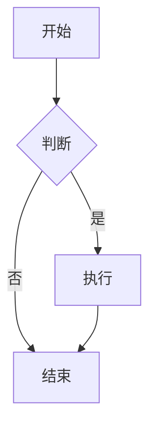

# 第 36 章：富媒体内容支持实现计划

## 目标

为编辑器添加更多内容类型支持：
1. 数学公式（LaTeX）
2. 流程图/思维导图（Mermaid）
3. 嵌入视频/音频
4. 文件附件

## 技术方案

### 1. 数学公式（LaTeX）

**依赖库：**
- `@tiptap/extension-mathematics` - Tiptap 官方数学扩展
- `katex` - LaTeX 渲染引擎
- `katex/dist/katex.min.css` - KaTeX 样式

**实现方式：**
- 行内公式：`$E=mc^2$`
- 块级公式：`$$\int_{a}^{b} f(x)dx$$`
- 工具栏添加公式按钮
- 斜杠命令：`/formula` 或 `/math`

**示例：**
```typescript
import Mathematics from '@tiptap/extension-mathematics'
import 'katex/dist/katex.min.css'

editor.configure({
  extensions: [
    Mathematics.configure({
      katexOptions: {
        throwOnError: false,
      },
    }),
  ],
})
```

---

### 2. 流程图/思维导图（Mermaid）

**依赖库：**
- `mermaid` - 图表渲染库
- 自定义 Tiptap Node 扩展

**实现方式：**
- 创建 `MermaidNode` 扩展
- 使用 `<pre><code class="language-mermaid">` 包裹
- 实时预览渲染
- 支持编辑和预览切换

**支持的图表类型：**
- 流程图（Flowchart）
- 时序图（Sequence Diagram）
- 甘特图（Gantt Chart）
- 类图（Class Diagram）
- 状态图（State Diagram）
- 饼图（Pie Chart）

**示例：**


---

### 3. 嵌入视频/音频

**实现方式：**
- 创建 `Video` 和 `Audio` Node 扩展
- 支持本地上传和 URL 嵌入
- 支持常见视频平台（YouTube、Bilibili、优酷）
- 自定义播放器控件

**支持格式：**
- 视频：MP4, WebM, Ogg
- 音频：MP3, WAV, Ogg
- 外部链接：YouTube, Bilibili, 优酷

**功能：**
- 拖拽上传
- URL 粘贴自动识别
- 播放控件
- 封面图设置
- 尺寸调整

---

### 4. 文件附件

**实现方式：**
- 创建 `Attachment` Node 扩展
- 文件上传到服务器
- 显示文件名、大小、类型
- 下载功能

**支持功能：**
- 拖拽上传
- 点击上传
- 文件预览（PDF、图片）
- 文件下载
- 文件删除

**文件存储：**
- 本地存储：`server/uploads/`
- 数据库记录：文件元信息
- 文件大小限制：10MB

---

## 实现步骤

### Step 1: 安装依赖
```bash
cd client
pnpm add @tiptap/extension-mathematics katex mermaid
pnpm add -D @types/katex
```

### Step 2: 数学公式扩展
1. 集成 `@tiptap/extension-mathematics`
2. 添加 KaTeX 样式
3. 工具栏添加公式按钮
4. 斜杠命令添加 `/formula`

### Step 3: Mermaid 扩展
1. 创建 `MermaidNode` 扩展
2. 实现渲染逻辑
3. 添加编辑/预览切换
4. 工具栏添加图表按钮
5. 斜杠命令添加 `/mermaid`

### Step 4: 视频/音频扩展
1. 创建 `Video` 和 `Audio` Node 扩展
2. 实现上传功能
3. 实现 URL 嵌入
4. 添加播放器控件
5. 工具栏添加媒体按钮

### Step 5: 文件附件扩展
1. 创建 `Attachment` Node 扩展
2. 实现文件上传 API
3. 实现文件下载功能
4. 添加文件管理界面
5. 工具栏添加附件按钮

### Step 6: 工具栏和斜杠命令更新
1. 更新 `MenuBar.tsx` 添加新按钮
2. 更新 `SlashCommands.ts` 添加新命令
3. 添加图标和提示文字

### Step 7: 样式优化
1. 数学公式样式
2. Mermaid 图表样式
3. 媒体播放器样式
4. 附件卡片样式

### Step 8: 测试和文档
1. 功能测试
2. 协同编辑测试
3. 编写 Chapter 36 教程文档

---

## 文件结构

```
client/src/
├── extensions/
│   ├── Mathematics.ts          # 数学公式扩展（使用官方）
│   ├── MermaidNode.ts          # Mermaid 图表扩展
│   ├── VideoNode.ts            # 视频扩展
│   ├── AudioNode.ts            # 音频扩展
│   └── AttachmentNode.ts       # 附件扩展
├── components/editor/
│   ├── MermaidEditor.tsx       # Mermaid 编辑器组件
│   ├── MediaUpload.tsx         # 媒体上传组件
│   └── AttachmentCard.tsx      # 附件卡片组件
└── styles/
    └── rich-content.css        # 富媒体内容样式

server/src/
├── routes/
│   └── upload.ts               # 文件上传路由
└── uploads/                    # 文件存储目录
```

---

## 预期效果

### 数学公式
- 行内公式：质能方程 $E=mc^2$ 在文本中
- 块级公式：
$$
\int_{a}^{b} f(x)dx = F(b) - F(a)
$$

### Mermaid 图表
- 流程图、时序图等自动渲染
- 点击可编辑源码
- 实时预览更新

### 视频/音频
- 嵌入式播放器
- 支持本地文件和外部链接
- 自定义封面和控件

### 文件附件
- 文件卡片显示
- 文件名、大小、类型
- 下载和删除按钮

---

## 注意事项

1. **性能优化**
   - Mermaid 渲染使用防抖
   - 大文件上传显示进度
   - 视频懒加载

2. **安全性**
   - 文件类型验证
   - 文件大小限制
   - XSS 防护

3. **协同编辑**
   - 确保所有扩展支持 Y.js 同步
   - 测试多人同时编辑

4. **移动端适配**
   - 响应式布局
   - 触摸友好的控件

---

## 开始实现

准备好了吗？我们从第一步开始：安装依赖和实现数学公式支持。
