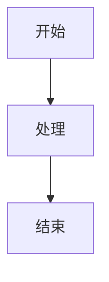

# Tiptap 编辑器深度优化建议

## 现状分析

经过前面的讨论，我们发现：
- ✅ 核心功能都有了（AI 生成、续写、改写、协同编辑等）
- ✅ 基础优化也做了（防抖、节流、React Hooks）
- ⚠️ 但编辑器体验还不够极致

**结论：下一步应该专注于 Tiptap 编辑器的深度优化，对标 Notion 的编辑体验。**

---

## 🎯 对标 Notion 的编辑体验

### Notion 的核心优势

1. **流畅的输入体验**
   - 无延迟的打字响应
   - 智能的格式化
   - 平滑的动画

2. **强大的块级操作**
   - 拖拽排序（我们已经有了，但需要修复）
   - 块级菜单（/ 命令）
   - 块级选择和操作

3. **优雅的交互细节**
   - 悬停效果
   - 过渡动画
   - 视觉反馈

4. **智能的内容处理**
   - 自动链接识别
   - Markdown 快捷输入
   - 智能粘贴

---

## 📋 Tiptap 编辑器优化清单

### 🔥 P0 - 核心体验（必须做）

#### 1. 修复拖拽功能 ⭐⭐⭐⭐⭐
**状态：** 已实现但有 bug，已添加开关（默认关闭）

**问题：**
- 拖拽后格式丢失
- 列表项拖拽有问题

**建议：**
- 先彻底修复，再默认开启
- 或者考虑使用 Tiptap 官方的拖拽扩展

**工作量：** 2-3 天

---

#### 2. 块级操作优化 ⭐⭐⭐⭐⭐

##### 2.1 块级悬停菜单
**功能：** 鼠标悬停在段落左侧显示操作菜单

```typescript
// 类似 Notion 的 6 点菜单
[⋮⋮] 段落内容
```

**操作：**
- 拖拽排序
- 删除块
- 复制块
- 转换块类型（段落→标题→列表等）
- 添加评论
- 复制链接

**实现：**
```typescript
// 创建 BlockMenu 组件
<BlockMenu
  position={position}
  onDrag={handleDrag}
  onDelete={handleDelete}
  onDuplicate={handleDuplicate}
  onTransform={handleTransform}
/>
```

**工作量：** 3-4 天

---

##### 2.2 斜杠命令增强
**当前状态：** 已有基础斜杠命令

**需要增强：**
- 更多命令类型
- 命令分类（基础块、媒体、高级等）
- 搜索和过滤
- 最近使用
- 自定义命令

**示例：**
```
/ 触发命令面板
  📝 基础块
    - 文本
    - 标题 1/2/3
    - 列表
    - 待办事项
  
  📷 媒体
    - 图片
    - 视频
    - 文件
  
  🤖 AI
    - AI 生成
    - AI 续写
    - AI 总结
  
  📊 高级
    - 表格
    - 代码块
    - 数学公式
    - 流程图
```

**工作量：** 2-3 天

---

#### 3. Markdown 快捷输入 ⭐⭐⭐⭐⭐

**功能：** 输入 Markdown 语法自动转换

**示例：**
```
# + 空格 → 一级标题
## + 空格 → 二级标题
- + 空格 → 无序列表
1. + 空格 → 有序列表
[] + 空格 → 待办事项
``` + 空格 → 代码块
> + 空格 → 引用块
--- → 分隔线
```

**当前状态：** 部分支持（Tiptap Markdown 扩展）

**需要增强：**
- 更多快捷输入
- 更智能的识别
- 可配置开关

**工作量：** 1-2 天

---

#### 4. 智能粘贴 ⭐⭐⭐⭐

**功能：** 根据粘贴内容智能处理

**示例：**
- 粘贴 URL → 自动转换为链接或嵌入
- 粘贴图片 → 自动上传
- 粘贴表格 → 保持格式
- 粘贴代码 → 自动识别语言
- 粘贴 Markdown → 自动转换

**实现：**
```typescript
// 自定义粘贴处理
editor.on('paste', (event) => {
  const { clipboardData } = event
  const text = clipboardData.getData('text/plain')
  const html = clipboardData.getData('text/html')
  
  // URL 检测
  if (isURL(text)) {
    event.preventDefault()
    insertLink(text)
  }
  
  // 图片检测
  if (clipboardData.files.length > 0) {
    event.preventDefault()
    uploadImages(clipboardData.files)
  }
  
  // Markdown 检测
  if (isMarkdown(text)) {
    event.preventDefault()
    insertMarkdown(text)
  }
})
```

**工作量：** 2-3 天

---

### 🎨 P1 - 视觉体验（应该做）

#### 5. 动画和过渡 ⭐⭐⭐⭐

**功能：** 添加平滑的动画效果

**示例：**
- 块级操作的淡入淡出
- 拖拽时的阴影效果
- 菜单展开/收起动画
- 内容插入/删除动画
- 光标移动动画

**实现：**
```css
/* 使用 Framer Motion 或 CSS 动画 */
.block-enter {
  animation: slideIn 0.2s ease-out;
}

.block-exit {
  animation: slideOut 0.2s ease-in;
}

@keyframes slideIn {
  from {
    opacity: 0;
    transform: translateY(-10px);
  }
  to {
    opacity: 1;
    transform: translateY(0);
  }
}
```

**工作量：** 2-3 天

---

#### 6. 悬停效果优化 ⭐⭐⭐

**功能：** 更好的悬停反馈

**示例：**
- 链接悬停预览
- 图片悬停放大
- 块级悬停高亮
- 按钮悬停效果

**工作量：** 1-2 天

---

#### 7. 占位符优化 ⭐⭐⭐

**功能：** 更智能的占位符提示

**示例：**
```typescript
// 根据块类型显示不同占位符
- 空段落：输入 / 查看命令
- 空标题：输入标题
- 空列表：输入列表项
- 空代码块：输入代码
```

**工作量：** 1 天

---

### 🚀 P2 - 高级功能（可以做）

#### 8. 块级引用和链接 ⭐⭐⭐⭐

**功能：** 类似 Notion 的块级引用

**示例：**
```
[[块ID]] → 引用其他块
@用户名 → 提及用户
#标签 → 添加标签
```

**工作量：** 5-7 天

---

#### 9. 内容块模板 ⭐⭐⭐

**功能：** 预定义的内容块模板

**示例：**
- 会议记录模板
- 项目计划模板
- 博客文章模板
- 代码文档模板

**工作量：** 3-4 天

---

#### 10. 数据库表格 ⭐⭐⭐⭐

**功能：** 类似 Notion 的数据库视图

**示例：**
- 表格视图
- 看板视图
- 日历视图
- 列表视图

**工作量：** 2-3 周（非常复杂）

---

#### 11. 数学公式支持 ⭐⭐⭐

**功能：** LaTeX 数学公式

**实现：**
```typescript
// 使用 KaTeX 或 MathJax
import { Mathematics } from '@tiptap-pro/extension-mathematics'

editor.configure({
  extensions: [
    Mathematics.configure({
      katexOptions: {
        throwOnError: false,
      },
    }),
  ],
})
```

**工作量：** 2-3 天

---

#### 12. 流程图/思维导图 ⭐⭐⭐⭐

**功能：** 嵌入式图表

**实现：**
```typescript
// 使用 Mermaid
import { Mermaid } from 'tiptap-extension-mermaid'

editor.configure({
  extensions: [Mermaid],
})
```

**示例：**
````

````

**工作量：** 3-4 天

---

#### 13. 代码块增强 ⭐⭐⭐⭐

**功能：** 更强大的代码块

**特性：**
- 行号显示
- 代码折叠
- 复制按钮
- 语言选择器
- 代码运行（JavaScript、Python）
- 代码 Diff 对比

**工作量：** 4-5 天

---

#### 14. 协作光标优化 ⭐⭐⭐

**功能：** 更好的协作体验

**特性：**
- 用户头像显示
- 用户名称显示
- 光标颜色区分
- 正在编辑的块高亮
- 跟随模式

**工作量：** 2-3 天

---

#### 15. 离线编辑 ⭐⭐⭐⭐

**功能：** 完整的离线支持

**特性：**
- 离线编辑
- 自动同步
- 冲突解决
- 离线提示

**工作量：** 1-2 周

---

## 🎯 推荐实施路线

### 第一阶段（1-2 周）- 核心体验
**目标：** 让编辑器用起来更流畅

1. **修复拖拽功能**（2-3 天）
2. **Markdown 快捷输入**（1-2 天）
3. **智能粘贴**（2-3 天）
4. **占位符优化**（1 天）

**总工作量：** 6-9 天

---

### 第二阶段（2-3 周）- 块级操作
**目标：** 对标 Notion 的块级体验

1. **块级悬停菜单**（3-4 天）
2. **斜杠命令增强**（2-3 天）
3. **动画和过渡**（2-3 天）
4. **悬停效果优化**（1-2 天）

**总工作量：** 8-12 天

---

### 第三阶段（3-4 周）- 高级功能
**目标：** 差异化竞争

1. **数学公式支持**（2-3 天）
2. **流程图/思维导图**（3-4 天）
3. **代码块增强**（4-5 天）
4. **协作光标优化**（2-3 天）

**总工作量：** 11-15 天

---

### 第四阶段（长期）- 生态建设
**目标：** 构建完整的编辑器生态

1. **块级引用和链接**（5-7 天）
2. **内容块模板**（3-4 天）
3. **离线编辑**（1-2 周）
4. **数据库表格**（2-3 周）- 可选

---

## 💡 我的建议

### 最应该做的 5 件事（按优先级）

1. **修复拖拽功能** ⭐⭐⭐⭐⭐
   - 这是基础功能，必须修好
   - 工作量：2-3 天

2. **Markdown 快捷输入** ⭐⭐⭐⭐⭐
   - 大幅提升输入效率
   - 工作量：1-2 天

3. **块级悬停菜单** ⭐⭐⭐⭐⭐
   - Notion 的核心体验
   - 工作量：3-4 天

4. **智能粘贴** ⭐⭐⭐⭐
   - 提升内容导入体验
   - 工作量：2-3 天

5. **斜杠命令增强** ⭐⭐⭐⭐
   - 更强大的内容插入
   - 工作量：2-3 天

**总工作量：** 10-15 天（2-3 周）

---

## 🚨 不建议立即做的

1. **数据库表格** - 太复杂，投入产出比低
2. **离线编辑** - 已有协同编辑，优先级不高
3. **块级引用** - 功能复杂，需求不明确

---

## 📊 对比分析

### 当前状态 vs Notion

| 功能 | 当前 | Notion | 差距 |
|------|------|--------|------|
| 基础编辑 | ✅ | ✅ | 无 |
| 协同编辑 | ✅ | ✅ | 无 |
| AI 功能 | ✅ 更强 | ⚠️ 一般 | 我们更好 |
| 拖拽排序 | ⚠️ 有 bug | ✅ | 需要修复 |
| 块级菜单 | ❌ | ✅ | 需要添加 |
| Markdown 快捷 | ⚠️ 部分 | ✅ | 需要增强 |
| 智能粘贴 | ❌ | ✅ | 需要添加 |
| 动画效果 | ⚠️ 一般 | ✅ 优秀 | 需要优化 |
| 数学公式 | ❌ | ✅ | 可选 |
| 数据库 | ❌ | ✅ | 不建议做 |

---

## 总结

**核心观点：**
你说得对，下一步应该专注于 **Tiptap 编辑器的深度优化**。

**优化方向：**
1. 修复现有功能（拖拽）
2. 增强基础体验（Markdown、粘贴）
3. 添加块级操作（悬停菜单、斜杠命令）
4. 优化视觉效果（动画、过渡）

**时间规划：**
- 第一阶段（1-2 周）：核心体验优化
- 第二阶段（2-3 周）：块级操作完善
- 第三阶段（3-4 周）：高级功能添加

**差异化竞争：**
- AI 功能已经比 Notion 强
- 编辑器体验追上 Notion
- 形成独特的 "AI + 协同编辑" 优势

**建议：**
先做第一阶段的 5 个优化（2-3 周），然后测试用户反馈，再决定下一步。
