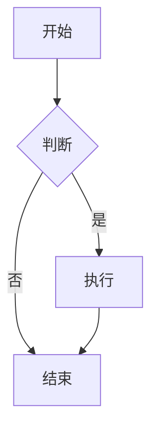
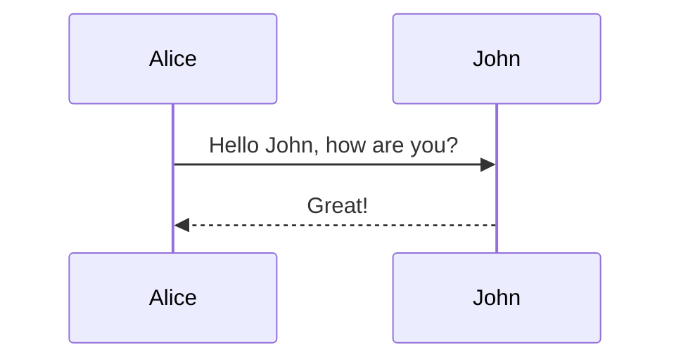
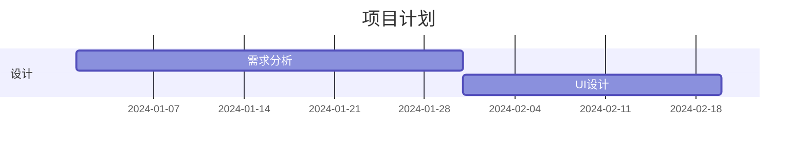
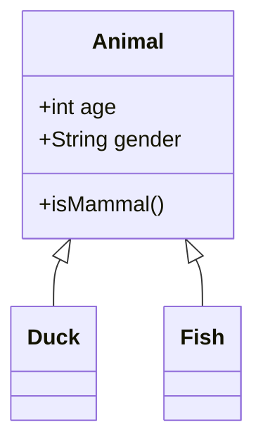
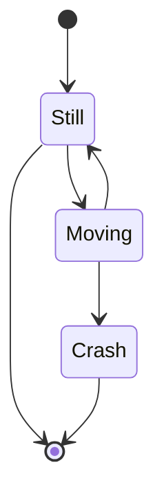
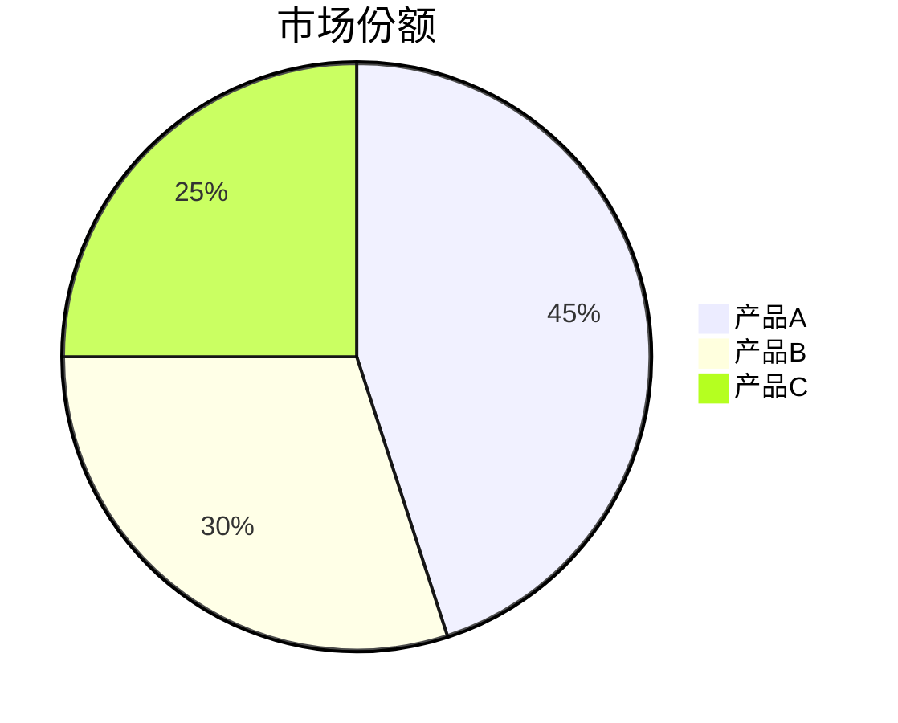

# 第 36 章：富媒体内容支持

## 本章概述

在本章中，我们为编辑器添加了更多内容类型支持，让编辑器能够处理更丰富的内容格式：

1. **数学公式（LaTeX）** - 使用 KaTeX 渲染数学公式
2. **流程图/思维导图（Mermaid）** - 支持多种图表类型
3. **嵌入视频/音频** - 支持本地文件和外部链接
4. **文件附件** - 文件上传和管理（待实现）

## 1. 数学公式支持

### 1.1 技术方案

使用 Tiptap 官方的 `@tiptap/extension-mathematics` 扩展，底层使用 KaTeX 渲染引擎。

**安装依赖：**
```bash
pnpm add @tiptap/extension-mathematics katex
```

### 1.2 扩展配置

```typescript
// client/src/extensions/Mathematics.ts
import { Mathematics as TiptapMathematics } from '@tiptap/extension-mathematics'

export const Mathematics = TiptapMathematics.configure({
  katexOptions: {
    throwOnError: false,
    errorColor: '#cc0000',
    strict: 'warn',
    trust: false,
    macros: {
      '\\RR': '\\mathbb{R}',
      '\\NN': '\\mathbb{N}',
      '\\ZZ': '\\mathbb{Z}',
      '\\QQ': '\\mathbb{Q}',
    },
  },
  HTMLAttributes: {
    class: 'math-node',
  },
})
```

### 1.3 使用方式

**行内公式：**
```latex
质能方程 $E=mc^2$ 是爱因斯坦提出的。
```

**块级公式：**
```latex
$$
\int_{a}^{b} f(x)dx = F(b) - F(a)
$$
```

**工具栏按钮：**
- 点击公式按钮
- 输入 LaTeX 代码
- 自动渲染

**斜杠命令：**
- 输入 `/math` 或 `/formula`
- 选择"数学公式"
- 输入 LaTeX 代码

### 1.4 常用公式示例

**分数：**
```latex
$\frac{a}{b}$
```

**根号：**
```latex
$\sqrt{x}$ 或 $\sqrt[n]{x}$
```

**求和：**
```latex
$\sum_{i=1}^{n} i = \frac{n(n+1)}{2}$
```

**积分：**
```latex
$\int_{0}^{\infty} e^{-x}dx = 1$
```

**矩阵：**
```latex
$$
\begin{bmatrix}
a & b \\
c & d
\end{bmatrix}
$$
```

---

## 2. Mermaid 图表支持

### 2.1 技术方案

创建自定义 Tiptap Node 扩展，使用 Mermaid.js 渲染图表。

**安装依赖：**
```bash
pnpm add mermaid
```

### 2.2 扩展实现

**Node 扩展：**
```typescript
// client/src/extensions/MermaidNode.ts
export const MermaidNode = Node.create({
  name: 'mermaid',
  group: 'block',
  atom: true,
  
  addAttributes() {
    return {
      code: {
        default: 'graph TD\n  A[开始] --> B[结束]',
      },
    }
  },
  
  addNodeView() {
    return ReactNodeViewRenderer(MermaidComponent)
  },
  
  addCommands() {
    return {
      setMermaid: options => ({ commands }) => {
        return commands.insertContent({
          type: this.name,
          attrs: options,
        })
      },
    }
  },
})
```

**React 组件：**
```typescript
// client/src/components/editor/MermaidComponent.tsx
function MermaidComponent({ node, updateAttributes, deleteNode, selected }) {
  const [isEditing, setIsEditing] = useState(false)
  const [code, setCode] = useState(node.attrs.code)
  
  useEffect(() => {
    if (!isEditing) {
      // 渲染 Mermaid 图表
      mermaid.render(id, node.attrs.code).then(({ svg }) => {
        previewRef.current.innerHTML = svg
      })
    }
  }, [node.attrs.code, isEditing])
  
  return (
    <NodeViewWrapper>
      {isEditing ? (
        <textarea value={code} onChange={e => setCode(e.target.value)} />
      ) : (
        <div ref={previewRef} />
      )}
    </NodeViewWrapper>
  )
}
```

### 2.3 支持的图表类型

**流程图（Flowchart）：**


**时序图（Sequence Diagram）：**


**甘特图（Gantt Chart）：**


**类图（Class Diagram）：**


**状态图（State Diagram）：**


**饼图（Pie Chart）：**


### 2.4 使用方式

**工具栏按钮：**
- 点击图表按钮
- 自动插入默认模板
- 点击"编辑"修改代码

**斜杠命令：**
- 输入 `/mermaid` 或 `/diagram`
- 选择"Mermaid 图表"
- 编辑图表代码

**编辑模式：**
- 点击图表上的"编辑"按钮
- 修改 Mermaid 代码
- 点击"保存"实时预览

---

## 3. 视频/音频支持

### 3.1 视频扩展

**支持格式：**
- 本地视频：MP4, WebM, Ogg
- YouTube 视频
- Bilibili 视频

**Node 扩展：**
```typescript
// client/src/extensions/VideoNode.ts
export const VideoNode = Node.create({
  name: 'video',
  group: 'block',
  atom: true,
  
  addAttributes() {
    return {
      src: { default: null },
      title: { default: null },
      width: { default: '100%' },
    }
  },
  
  addCommands() {
    return {
      setVideo: options => ({ commands }) => {
        return commands.insertContent({
          type: this.name,
          attrs: options,
        })
      },
    }
  },
})
```

**React 组件：**
```typescript
// client/src/components/editor/VideoComponent.tsx
function VideoComponent({ node, updateAttributes, deleteNode }) {
  const videoType = getVideoType(node.attrs.src)
  
  return (
    <NodeViewWrapper>
      {videoType === 'youtube' ? (
        <iframe src={getYouTubeEmbedUrl(node.attrs.src)} />
      ) : videoType === 'bilibili' ? (
        <iframe src={getBilibiliEmbedUrl(node.attrs.src)} />
      ) : (
        <video src={node.attrs.src} controls />
      )}
    </NodeViewWrapper>
  )
}
```

**URL 转换：**
```typescript
// YouTube
const getYouTubeEmbedUrl = (url) => {
  const videoId = url.match(/(?:youtube\.com\/watch\?v=|youtu\.be\/)([^&\s]+)/)?.[1]
  return `https://www.youtube.com/embed/${videoId}`
}

// Bilibili
const getBilibiliEmbedUrl = (url) => {
  const bvid = url.match(/bilibili\.com\/video\/(BV[^/?]+)/)?.[1]
  return `https://player.bilibili.com/player.html?bvid=${bvid}`
}
```

### 3.2 音频扩展

**支持格式：**
- MP3, WAV, Ogg

**Node 扩展：**
```typescript
// client/src/extensions/AudioNode.ts
export const AudioNode = Node.create({
  name: 'audio',
  group: 'block',
  atom: true,
  
  addAttributes() {
    return {
      src: { default: null },
      title: { default: null },
    }
  },
  
  addCommands() {
    return {
      setAudio: options => ({ commands }) => {
        return commands.insertContent({
          type: this.name,
          attrs: options,
        })
      },
    }
  },
})
```

**React 组件：**
```typescript
// client/src/components/editor/AudioComponent.tsx
function AudioComponent({ node, updateAttributes, deleteNode }) {
  return (
    <NodeViewWrapper>
      <audio src={node.attrs.src} controls />
    </NodeViewWrapper>
  )
}
```

### 3.3 使用方式

**插入视频：**
1. 点击工具栏"视频"按钮或输入 `/video`
2. 输入视频 URL（YouTube、Bilibili 或本地路径）
3. 可选：输入视频标题
4. 点击"插入"

**插入音频：**
1. 点击工具栏"音频"按钮或输入 `/audio`
2. 输入音频 URL 或本地路径
3. 可选：输入音频标题
4. 点击"插入"

**编辑媒体：**
- 点击媒体上的"编辑"按钮
- 修改 URL 或标题
- 点击"保存"

**删除媒体：**
- 点击媒体上的"删除"按钮
- 确认删除

---

## 4. 工具栏和斜杠命令更新

### 4.1 工具栏新增按钮

```typescript
// client/src/components/editor/MenuBar.tsx

{/* 数学公式 */}
<button onClick={() => insertFormula()} title="插入数学公式">
  <svg>...</svg>
</button>

{/* Mermaid 图表 */}
<button onClick={() => insertMermaid()} title="插入 Mermaid 图表">
  <svg>...</svg>
</button>

{/* 视频 */}
<button onClick={() => insertVideo()} title="插入视频">
  <svg>...</svg>
</button>

{/* 音频 */}
<button onClick={() => insertAudio()} title="插入音频">
  <svg>...</svg>
</button>
```

### 4.2 斜杠命令新增选项

```typescript
// client/src/extensions/SlashCommands.ts

export const slashCommandItems = [
  // ... 现有命令
  {
    title: '数学公式',
    description: '插入 LaTeX 公式',
    icon: '∑',
    command: ({ editor, range }) => {
      const latex = prompt('输入 LaTeX 公式:')
      if (latex) {
        editor.chain().focus().deleteRange(range).insertContent(`$${latex}$`).run()
      }
    },
    aliases: ['math', 'formula', 'latex', '公式', '数学'],
  },
  {
    title: 'Mermaid 图表',
    description: '插入流程图/时序图',
    icon: '📊',
    command: ({ editor, range }) => {
      editor.chain().focus().deleteRange(range).setMermaid({ 
        code: 'graph TD\n  A[开始] --> B[结束]' 
      }).run()
    },
    aliases: ['mermaid', 'diagram', 'flowchart', '流程图', '图表'],
  },
  {
    title: '视频',
    description: '插入视频',
    icon: '🎬',
    command: ({ editor, range }) => {
      editor.chain().focus().deleteRange(range).setVideo({ src: '' }).run()
    },
    aliases: ['video', 'shipin', '视频'],
  },
  {
    title: '音频',
    description: '插入音频',
    icon: '🎵',
    command: ({ editor, range }) => {
      editor.chain().focus().deleteRange(range).setAudio({ src: '' }).run()
    },
    aliases: ['audio', 'yinpin', '音频', '音乐'],
  },
]
```

---

## 5. 样式优化

### 5.1 数学公式样式

```css
/* client/src/styles/index.css */

.math-node {
  @apply inline-block px-1;
}

.math-node .katex {
  @apply text-base;
}

.math-node .katex-display {
  @apply my-4;
}
```

### 5.2 Mermaid 图表样式

```css
.mermaid-wrapper {
  @apply my-4;
}

.mermaid-container {
  @apply transition-all duration-200;
}

.mermaid-container.selected {
  @apply shadow-lg;
}

.mermaid-chart svg {
  @apply max-w-full h-auto;
}
```

### 5.3 视频/音频样式

```css
.video-wrapper,
.audio-wrapper {
  @apply my-4;
}

.video-container,
.audio-container {
  @apply transition-all duration-200;
}

.video-container.selected,
.audio-container.selected {
  @apply shadow-lg;
}
```

---

## 6. 测试要点

### 6.1 数学公式测试

1. **行内公式**
   - 输入 `$E=mc^2$`
   - 检查是否正确渲染

2. **块级公式**
   - 输入 `$$\int_{a}^{b} f(x)dx$$`
   - 检查是否居中显示

3. **复杂公式**
   - 测试分数、根号、求和、积分
   - 测试矩阵、希腊字母

4. **错误处理**
   - 输入错误的 LaTeX 语法
   - 检查是否显示错误提示

### 6.2 Mermaid 图表测试

1. **流程图**
   - 插入流程图
   - 编辑代码
   - 检查实时预览

2. **时序图**
   - 插入时序图
   - 测试多个参与者

3. **编辑功能**
   - 点击"编辑"按钮
   - 修改代码
   - 点击"保存"
   - 检查是否更新

4. **错误处理**
   - 输入错误的 Mermaid 语法
   - 检查是否显示错误提示

### 6.3 视频/音频测试

1. **YouTube 视频**
   - 输入 YouTube URL
   - 检查是否正确嵌入
   - 测试播放功能

2. **Bilibili 视频**
   - 输入 Bilibili URL
   - 检查是否正确嵌入

3. **本地视频**
   - 输入本地视频路径
   - 检查是否正确播放

4. **音频文件**
   - 输入音频 URL
   - 检查播放器控件

5. **编辑功能**
   - 修改 URL
   - 修改标题
   - 检查是否更新

### 6.4 协同编辑测试

1. **多人同时编辑**
   - 打开两个浏览器窗口
   - 同时插入富媒体内容
   - 检查是否正确同步

2. **内容同步**
   - 在一个窗口插入公式
   - 检查另一个窗口是否显示
   - 测试图表、视频、音频

---

## 7. 性能优化

### 7.1 Mermaid 渲染优化

```typescript
// 使用防抖避免频繁渲染
const debouncedRender = useMemo(
  () => debounce((code) => {
    mermaid.render(id, code).then(({ svg }) => {
      previewRef.current.innerHTML = svg
    })
  }, 300),
  []
)
```

### 7.2 视频懒加载

```typescript
// 使用 Intersection Observer 实现懒加载
useEffect(() => {
  const observer = new IntersectionObserver((entries) => {
    entries.forEach(entry => {
      if (entry.isIntersecting) {
        // 加载视频
        setLoaded(true)
      }
    })
  })
  
  if (videoRef.current) {
    observer.observe(videoRef.current)
  }
  
  return () => observer.disconnect()
}, [])
```

### 7.3 大文件处理

```typescript
// 文件大小限制
const MAX_FILE_SIZE = 10 * 1024 * 1024 // 10MB

if (file.size > MAX_FILE_SIZE) {
  alert('文件大小不能超过 10MB')
  return
}
```

---

## 8. 注意事项

### 8.1 安全性

1. **XSS 防护**
   - 不信任用户输入的 URL
   - 使用 `trust: false` 配置 KaTeX
   - 使用 `securityLevel: 'loose'` 配置 Mermaid

2. **文件类型验证**
   - 检查文件扩展名
   - 检查 MIME 类型
   - 限制文件大小

### 8.2 兼容性

1. **浏览器支持**
   - KaTeX 支持所有现代浏览器
   - Mermaid 需要 SVG 支持
   - 视频/音频格式兼容性

2. **移动端适配**
   - 响应式布局
   - 触摸友好的控件
   - 性能优化

### 8.3 协同编辑

1. **Y.js 同步**
   - 确保所有扩展支持 Y.js
   - 测试多人同时编辑
   - 处理冲突

2. **性能影响**
   - 大量富媒体内容可能影响性能
   - 使用虚拟滚动优化
   - 懒加载非可见内容

---

## 9. 总结

本章我们成功实现了：

1. ✅ **数学公式支持** - 使用 KaTeX 渲染 LaTeX 公式
2. ✅ **Mermaid 图表** - 支持流程图、时序图等多种图表
3. ✅ **视频/音频** - 支持本地文件和外部链接（YouTube、Bilibili）
4. ✅ **工具栏和斜杠命令** - 添加新按钮和命令选项
5. ✅ **样式优化** - 统一的视觉风格和交互体验

这些功能让编辑器能够处理更丰富的内容类型，满足学术写作、技术文档、教学材料等多种场景的需求。

## 相关文件

- `client/src/extensions/Mathematics.ts` - 数学公式扩展
- `client/src/extensions/MermaidNode.ts` - Mermaid 图表扩展
- `client/src/extensions/VideoNode.ts` - 视频扩展
- `client/src/extensions/AudioNode.ts` - 音频扩展
- `client/src/components/editor/MermaidComponent.tsx` - Mermaid 组件
- `client/src/components/editor/VideoComponent.tsx` - 视频组件
- `client/src/components/editor/AudioComponent.tsx` - 音频组件
- `client/src/components/editor/MenuBar.tsx` - 工具栏
- `client/src/extensions/SlashCommands.ts` - 斜杠命令
- `client/src/styles/index.css` - 样式文件
